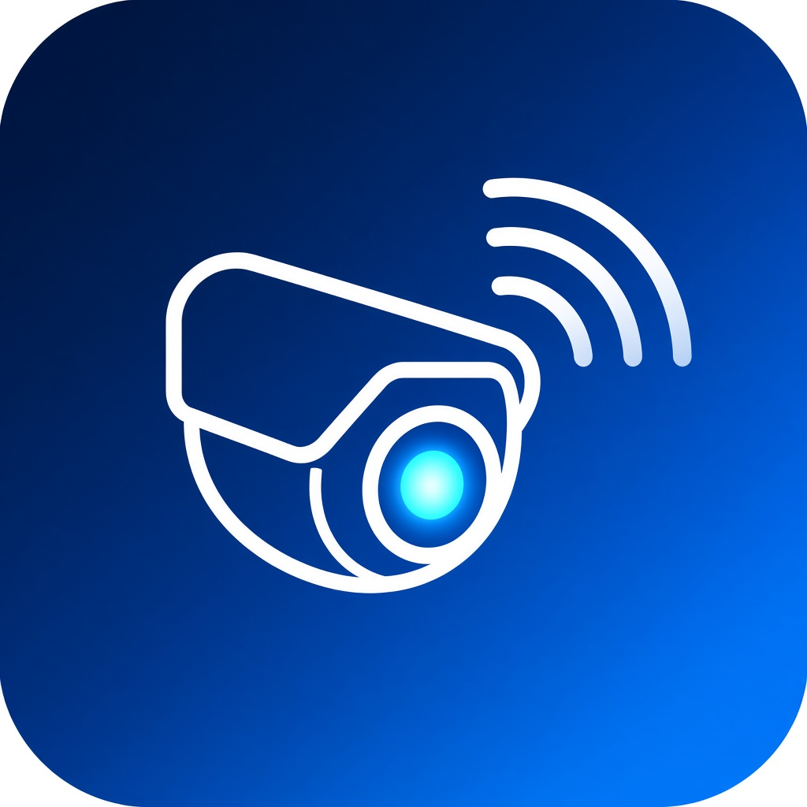

# GoEzviz




Lightweight IP camera viewer written in Go. Talks to cameras over ONVIF and RTSP — no cloud, no account.

**Homologated camera:** [EZVIZ H9c](https://www.ezviz.com/) (both lenses — main and secondary). Other ONVIF cameras may work, but only the H9c has been validated.


## Download

releases: [Releases](https://github.com/lunodesouza/GoEzviz/releases).


| Platform              | Package                                                                                                                                                                                             | Notes                                                                   |
| --------------------- | --------------------------------------------------------------------------------------------------------------------------------------------------------------------------------------------------- | ----------------------------------------------------------------------- |
| Windows (amd64)       | [GoEzviz-1.0.0-with-ffmpeg-completed-windows-amd64.zip](https://github.com/lunodesouza/GoEzviz/releases/download/1.0.0-with-ffmpeg-completed/GoEzviz-1.0.0-with-ffmpeg-completed-windows-amd64.zip) | FFmpeg included. Unzip and run `GoEzviz.exe`.                           |
| macOS (Apple Silicon) | [GoEzviz-1.0.0-macos-arm64.zip](https://github.com/lunodesouza/GoEzviz/releases/download/1.0.0-with-ffmpeg-completed/GoEzviz-1.0.0-macos-arm64.zip)                                                 | Requires FFmpeg (`brew install ffmpeg`). Intel Macs: build from source. |
| Linux                 | —                                                                                                                                                                                                   | No binary yet — [build from source](#build).                            |


## Features

- Automatic ONVIF discovery on the LAN
- Multiple cameras and profiles in a grid; double-click to maximize
- Camera audio, volume control, and PTZ (arrow keys)
- **Talk**: sends the PC microphone to the camera speaker (AAC backchannel)
- Microphone listing on Windows (DirectShow) and macOS (AVFoundation)
- Auto-reconnect and saved settings; passwords protected with DPAPI (Windows) or AES-256 (Linux/macOS)


## Requirements

- [Go 1.25+](https://go.dev/dl/)
- A C compiler (required by Fyne)
- FFmpeg (`ffmpeg` and `ffplay`): the Windows zip ships them next to the app. On Linux/macOS, install FFmpeg (or, on Windows, run `scripts/fetch-ffmpeg-windows.ps1` when building from source).


## Build

**Windows** (C compiler: [TDM-GCC](https://jmeubank.github.io/tdm-gcc/) or MinGW)

```powershell
./scripts/fetch-ffmpeg-windows.ps1   # once; puts binaries in resources/ffmpeg
go build -ldflags "-H=windowsgui -s -w" -o GoEzviz.exe .
./scripts/package-windows.ps1        # dist/GoEzviz-1.0.0-with-ffmpeg-completed-windows-amd64.zip
```

**Linux**

```bash
sudo apt install golang gcc libgl1-mesa-dev xorg-dev ffmpeg
go build -ldflags "-s -w" -o GoEzviz .
```

**macOS**

```bash
xcode-select --install
brew install go ffmpeg
go build -ldflags "-s -w" -o GoEzviz .
```

For a Dock and Finder icon, package the app on a Mac (`assets/icon.icns` is already in the repo):

```bash
./scripts/package-macos.sh
open GoEzviz.app
```

After changing `assets/icon.png`, regenerate `icon.icns` with `./scripts/make-icns.sh` and commit it.

## Usage

Open the app, click **Devices**, use **Discover LAN** or add an IP, enter the camera username and password, refresh ONVIF profiles, and select the ones you want. Then click **Connect**.

On first **Talk** on macOS, the system may ask for microphone access. If it is denied, GoEzviz opens **System Settings → Privacy & Security → Microphone**.

## Contributing

Want to add support for more cameras or brands? Feel free to collaborate — fork the repo and open a pull request.

## License

MIT